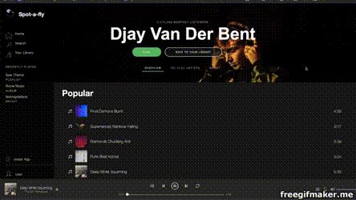

# Spot-A-Fly - Header Microservice

A clone of the Spotify artist page.


## Getting Started

Clone this repository from by running:
`git clone https://github.com/juicy-fec/ian-header-component.git`

### Prerequisites

Node.js
npm

### Installing

Install all dependencies.
Seed MongoDB database.
Run server.

```
npm install
npm run seed-database
npm start
```

Navigate to http://localhost:3001 to visit the Spot-A-Fly header service.

## Running the tests

`npm run test`

## Deployment

Add additional notes about how to deploy this on a live system

## Built With

* [MongoDB](https://www.mongodb.com/)
* [Express.js](https://expressjs.com/)
* [React](https://reactjs.org/)
* [Node.js](https://nodejs.org/en/)
* [Jest](https://jestjs.io/)
* [react-testing-library](https://github.com/testing-library/react-testing-library)

## Authors

* **Ian Salmon** - [GitHub](https://github.com/IanGSalmon)

## License

This project is licensed under the MIT License - see the [LICENSE.md](LICENSE.md) file for details

## Acknowledgments

* Thank you to the Juicy-FEC squad. Thanks for being amazing teammates!
* Thank you to my wife, Anna, for supporting me through all of the all-night code sprints.
